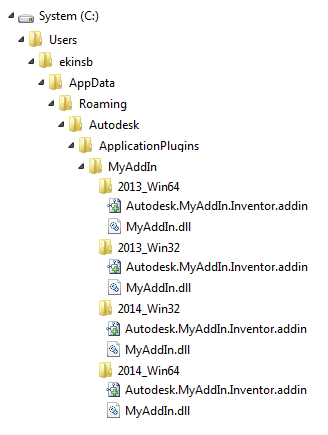

# InventorBuildTool

This is a tool that I put together to help me with my day to day Autodesk Inventor development chores. It starts with two main commands for deploying the addin file for debugging and for updating an addin file with Inventor version information.

## deploy

Use this command to copy the ```.addin``` file from the development directory to the desired Inventor addin location so that Inventor will pick it up. It will also update the ```<Assembly>``` tag in the addin file to point back to the location of the debug build dll.

``` powershell

addinxform.exe deploy --addinpath "C:\git\Sample\Sample.Inventor.addin" --destination "C:\ProgramData\Autodesk\Inventor 2021\Addins" --dllpath "C:\git\Sample\bin\Debug\Bom2Excel.dll"

```

### Options for deploy command

| Name            | Description |
|-----------------|-------------|
| --addinpath     | This is the location of the addin file that you want to copy from your dev directory to a place where Inventor can find it. |
| --destination   | This is the location that you want the .addin file to end up in, in this case, it is going to place it in the all users 2021 specific version of Inventor. |
| --dllpath       | This is the path to the dll that Inventor loads. After being copied to the destination above, the ```<Assembly>``` node will be updated to contain this value. |

## update

This command can be used by app store developers who use the [guidance](https://help.autodesk.com/view/INVNTOR/2024/ENU/?guid=GUID-52422162-1784-4E8F-B495-CDB7BE9987AB) provided by Autodesk in setting up deploy packages for submission to the store.

Once you build up the bundle to the store, you can use the ```update``` command to update the individual ```.addin``` files with the appropriate version information so that each version of Inventor picks up the correct addin version. Picture below was taken from Inventor help site.




``` powershell

addinxform.exe update --addinpath "C:\users\mike\AppData\Roaming\Autodesk\ApplicationPlugins\Sample.Inventor.addin" --SupportedSoftwareVersionGreaterThan "25.." --SupportedSoftwareVersionLessThan "29.."

```

### Options for update command

| Name                                  | Description |
|---------------------------------------|-------------|
| --addinpath                           | This is the location of the addin file that you want to modify. In the sample above, we are modifying it to be compatible with Inventor 2021 through Inventor 2024, but not Inventor 2025 and later. |
| --SupportedSoftwareVersionEqualTo     | Update the ```SupportedSoftwareVersionEqualTo``` node with supplied value. |
| --SupportedSoftwareVersionGreaterThan | Update the ```SupportedSoftwareVersionGreaterThan``` node with the supplied value. |
| --SupportedSoftwareVersionLessThan    | Update the ```SupportedSoftwareVersionLessThan``` with the supplied value. |
| --SupportedSoftwareVersionNotEqualTo  | Update the ```SupportedSoftwareVersionNotEqualTo``` wit the supplied value. |
